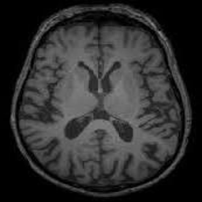
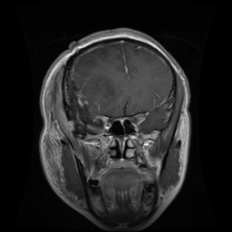
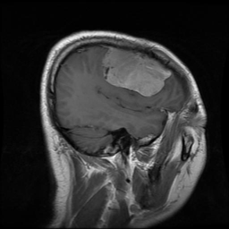
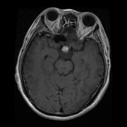
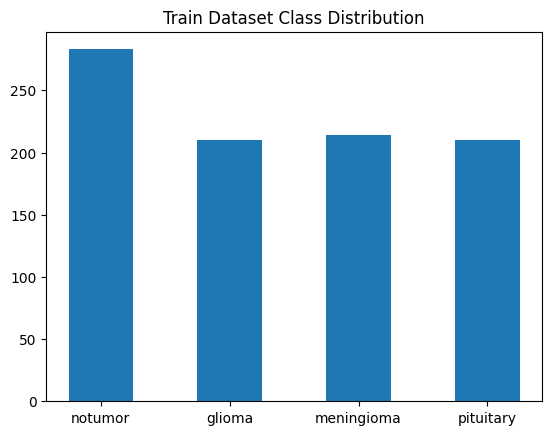
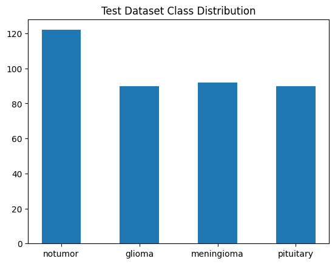
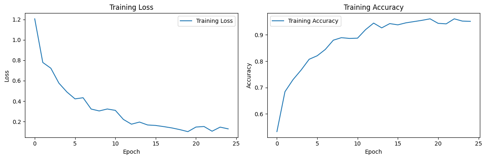
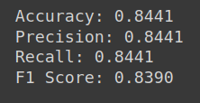

# Tumor Detection

## Introduction
This project aims to detect and classify MRI images of the brain for the diagnosis of different brain tumors. We implement a convolutional neural network for image classification using the PyTorch framework.

## Dataset
The dataset used in this project consists of MRI images categorized into four classes:
- Notumor



- Glioma



- Meningioma



- Pituitary



## Implementation
We utilize PyTorch for building and training the convolutional neural network. The network architecture is designed to effectively classify MRI images into their respective tumor categories.

## Getting Started
To get started with the project:
* Clone the repository:
   ```bash
   git clone https://github.com/SaliDeveloper/tumor_detection.git
   ```

## Results

* Dataset distribution:

 

* Plot loss and accuracy during trining:



* evaluation results of the trained model on the test dataset:



## Contributions
Contributions to the project are welcome. If you find any issues or have suggestions for improvement, please feel free to open an issue or submit a pull request.

## License
This project is licensed under the [MIT License](LICENSE).
